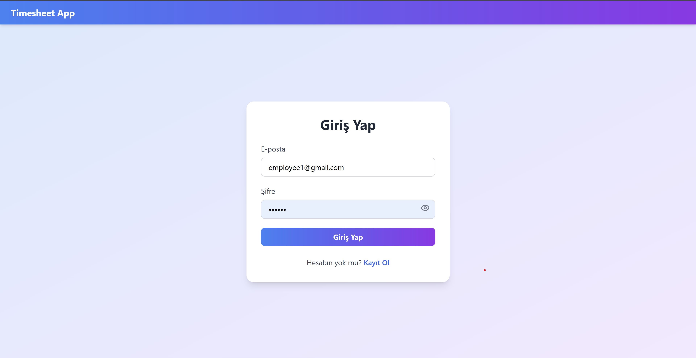
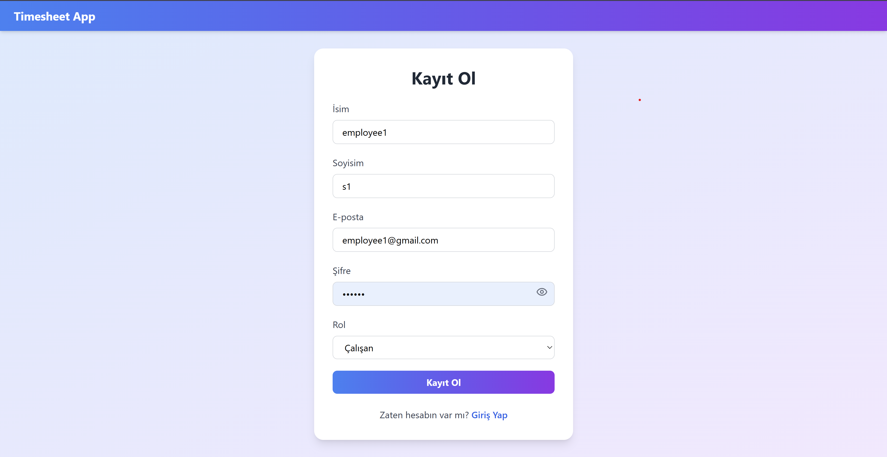
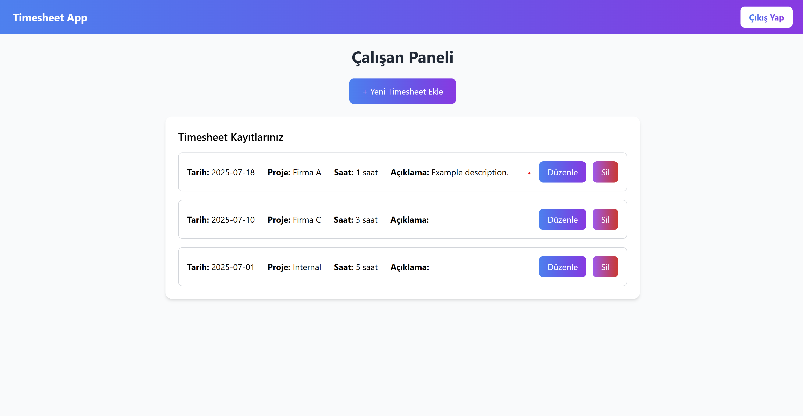
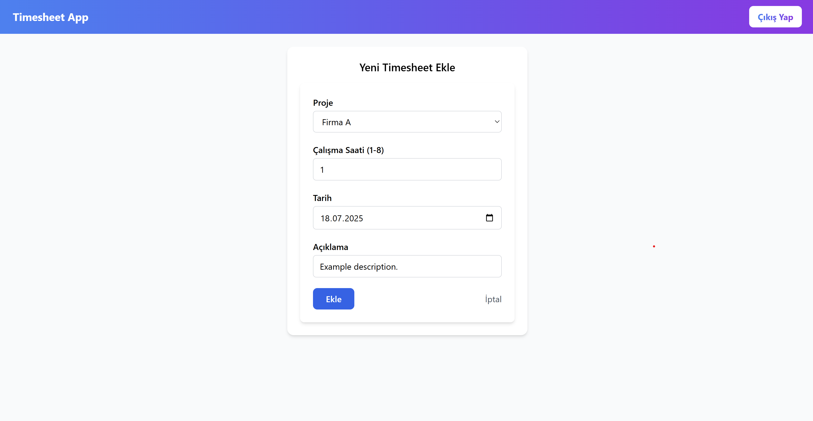
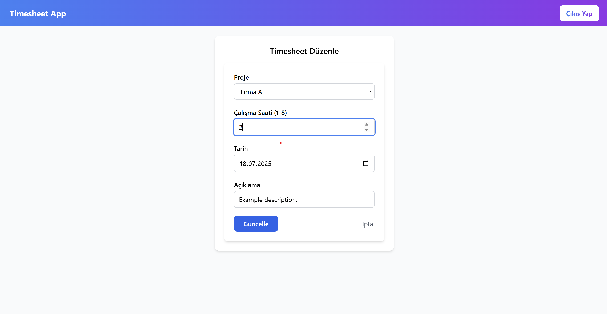
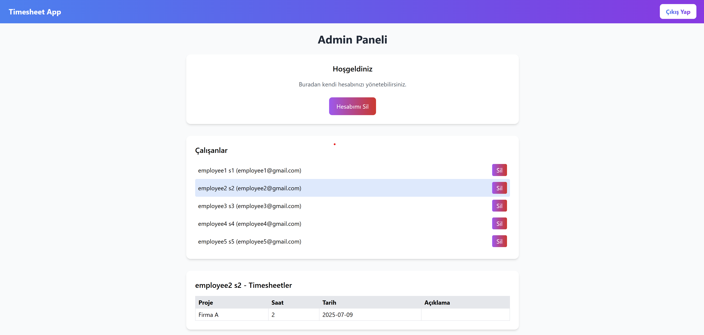
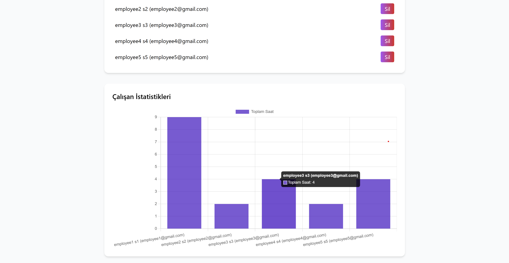

# ⏱️ Timesheet Management App

A full-stack web application for tracking employee working hours and managing timesheets.  
Admins can manage employees, view their total working hours in charts, and delete accounts.  
Employees can log their working hours per project.

---

## 📸 Screenshots

### 🔹 Login Page

### 🔹 Signup Page

### 🔹 Employee Page

### 🔹 Add Timesheet Page

### 🔹 Edit Timesheet Page

### 🔹 Admin Dashboard

### 🔹 Employee Stats Page

---

## 🚀 Features

✅ **Authentication** – JWT-based login/signup  
✅ **Role-based Access** – Admins & Employees have separate views  
✅ **Timesheet Management** – Employees can add, edit, and delete timesheets  
✅ **Admin Panel** –  
   - View all employees and their timesheets  
   - View total hours per employee (chart)  
   - Delete employee accounts  
   - Delete own admin account  
✅ **Responsive UI** – Built with React + TailwindCSS  

---

## 🛠️ Tech Stack

### **Frontend**  
- React + TailwindCSS  
- React Router for navigation  
- Chart.js (for hours graph)

### **Backend**  
- Flask (Python)  
- Flask-JWT-Extended (authentication)  
- SQLAlchemy + SQLite/MySQL (database)  

---

